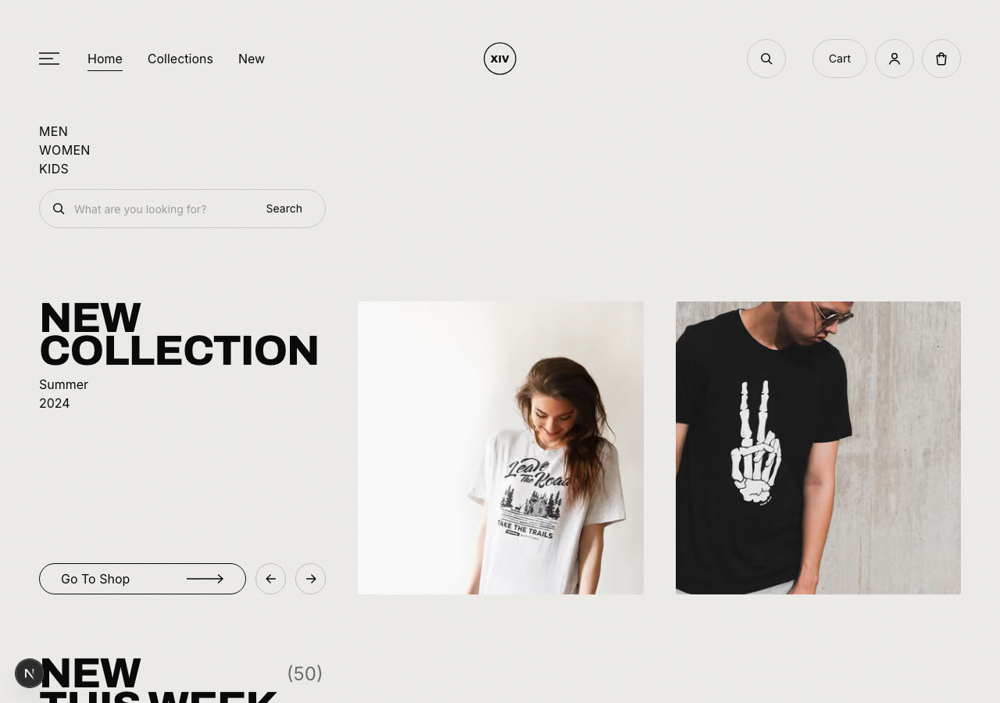

# XIV — Fashion Store

A fashion e-commerce storefront built from a Figma design system, implemented
with the Next.js App Router, TypeScript and Tailwind CSS v4.

**Live:** https://cloth-store.vercel.app



---

## What is in here

| Route | What it does |
| --- | --- |
| `/` | Hero carousel, New This Week grid, the XIV Collections 23–24 grid with audience filters and price sorting, and a staggered atelier gallery |
| `/products` | Filter rail (size, availability, category), collection and category chips, text search, and a three-column grid |
| `/products/[slug]` | Gallery with a thumbnail rail, colourway and size pickers, add to bag, favourite toggle, related pieces |
| `/cart` | Shopping bag and favourites tabs, per-line quantity stepper, order summary gated on the terms checkbox |
| `/checkout` | Three-step flow — contact details, shipping address, payment — with a live order panel and a confirmation state |

Every product route is prerendered at build time from the catalogue in
`src/lib/products.ts`.

## Design notes

The layout is built to the source artboards: a 1280px frame with 50px gutters,
a warm paper-and-ink palette, and an inline SVG film grain so the texture costs
no extra network request. Archivo carries the display type, Inter the UI.

Scroll reveals render **visible** on the server and only hide elements that
start below the fold, so a slow or failed hydration can never leave the page
blank.

## Imagery

Product photography is served through the Unsplash image CDN. `src/lib/images.ts`
wraps the transform API so one source photo is requested at exactly the size each
surface needs — grid thumbnail, detail hero, cart line item — with AVIF/WebP
negotiated by `next/image`. No API key is required.

## State

The bag and favourites live in `localStorage` behind a small external store
(`src/lib/persisted-store.ts`) read through `useSyncExternalStore`. Consumers
stay in step without a provider in the tree, writes from another tab are
mirrored in, and the server snapshot keeps hydration stable.

## Running it

```bash
npm install
npm run dev
```

Then open http://localhost:3000.

```bash
npm run build     # production build
npm run lint      # eslint
npm run smoke     # Playwright pass over the shopping flow (needs the dev server)
```

The smoke run covers add-to-bag from both the card and the detail page,
persistence across a reload, the quantity stepper, the terms gate, line removal,
category and text search, and image health.

## Stack

- Next.js 16 (App Router, Turbopack)
- React 19 + TypeScript
- Tailwind CSS v4
- Playwright for the smoke run
- Deployed on Vercel
