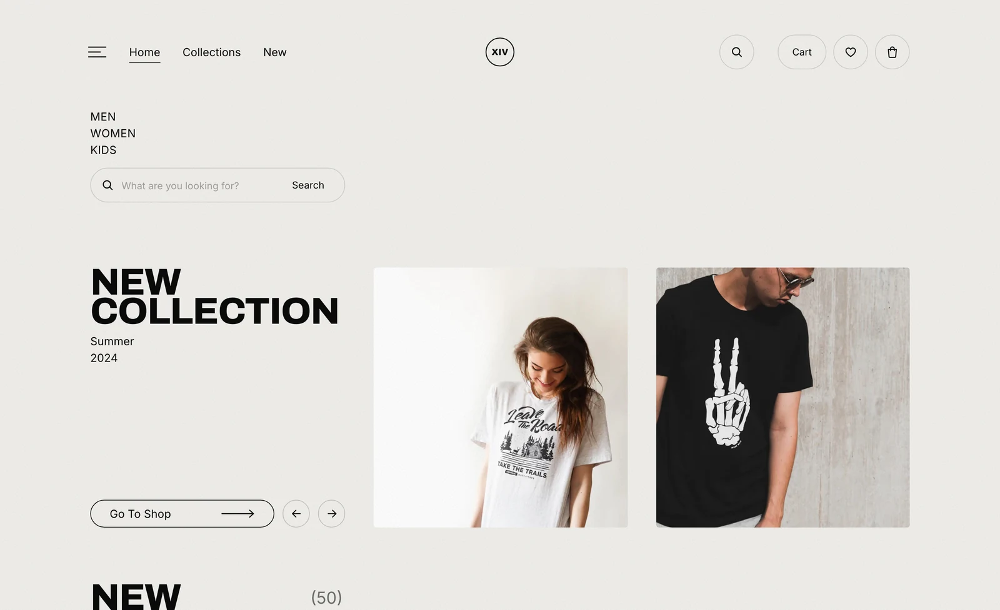
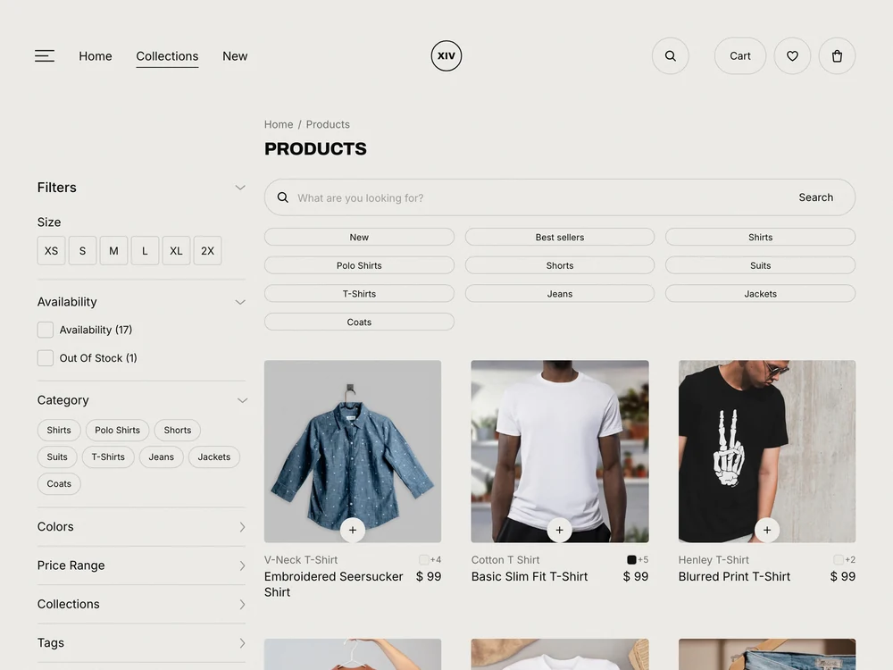
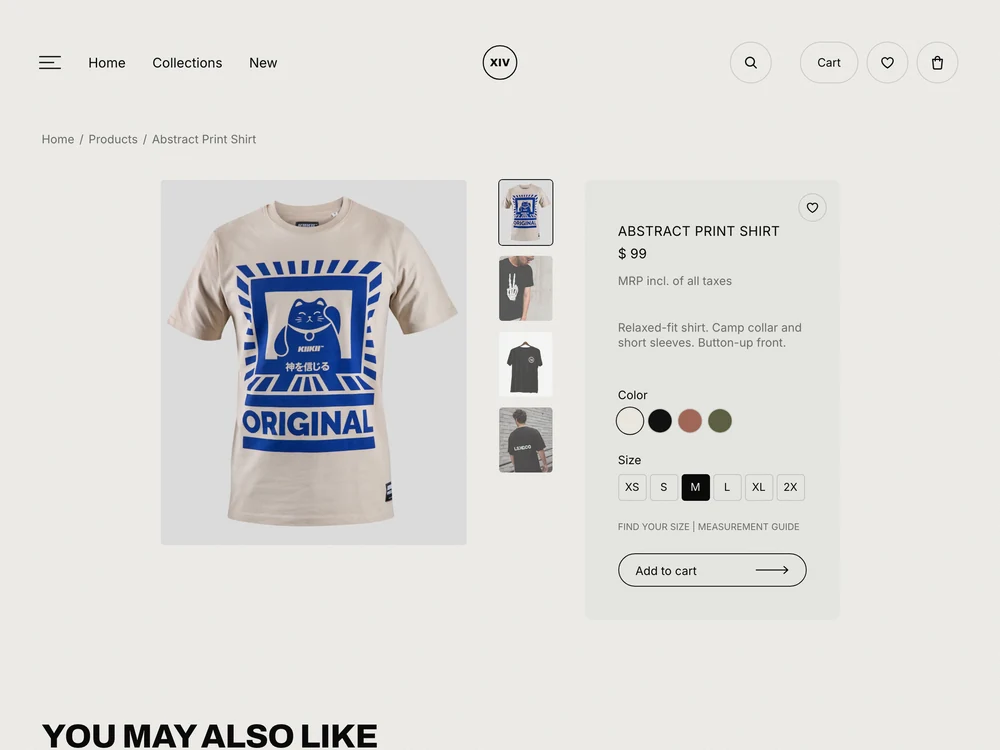
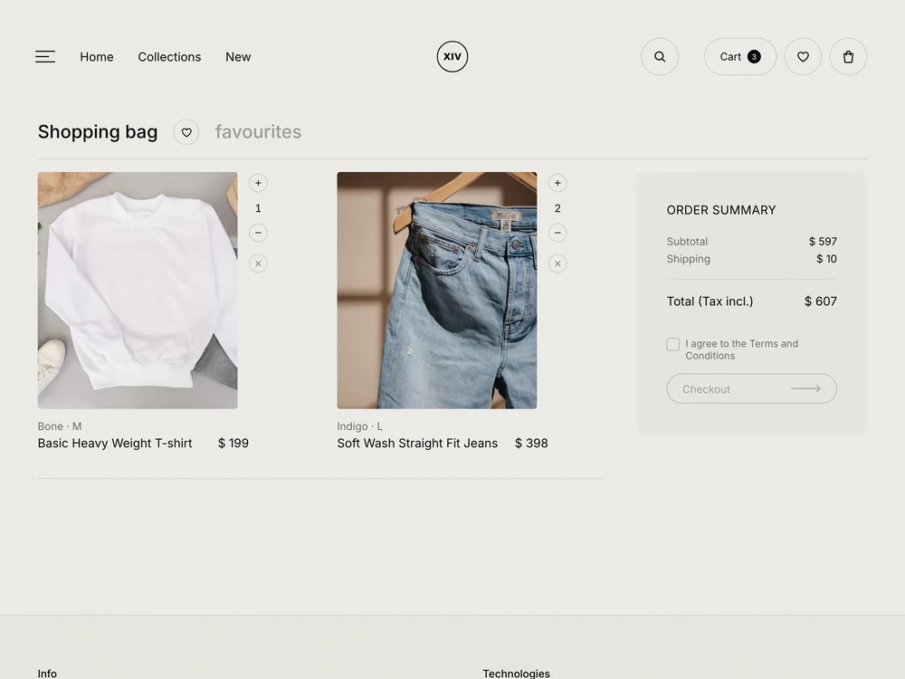
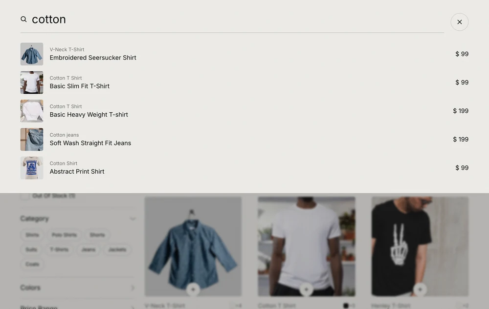
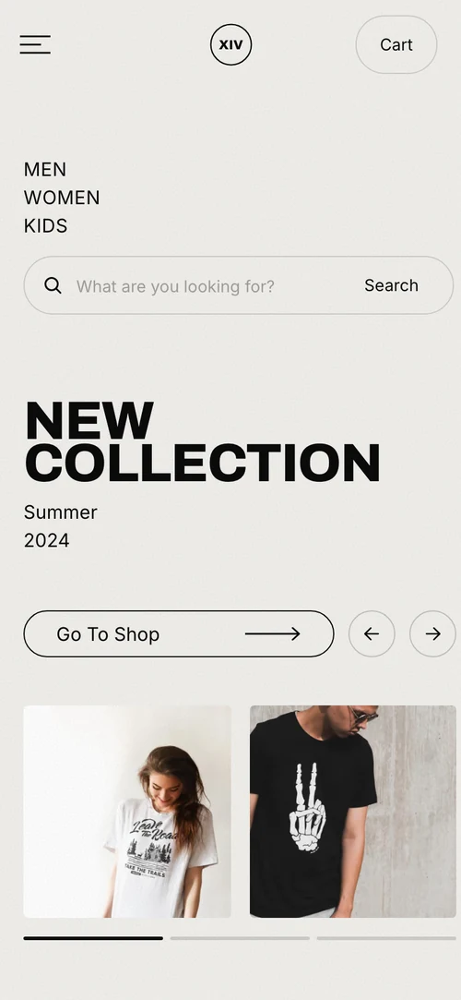

<div align="center">

# XIV

**A fashion e-commerce storefront, built from a Figma design system.**

[](https://nextjs.org)
[](https://react.dev)
[](https://www.typescriptlang.org)
[](https://tailwindcss.com)
[](https://cloth-store-gules.vercel.app)
[](LICENSE)

### [View it live →](https://cloth-store-gules.vercel.app)

</div>

<br>



<br>

## Screens

<table>
  <tr>
    <td width="33%"></td>
    <td width="33%"></td>
    <td width="33%"></td>
  </tr>
  <tr>
    <td align="center"><sub><b>Listing</b> — filters, chips, search</sub></td>
    <td align="center"><sub><b>Detail</b> — gallery, colourway, size</sub></td>
    <td align="center"><sub><b>Bag</b> — steppers, order summary</sub></td>
  </tr>
  <tr>
    <td colspan="2"></td>
    <td></td>
  </tr>
  <tr>
    <td colspan="2" align="center"><sub><b>Search overlay</b> — live results as you type</sub></td>
    <td align="center"><sub><b>Responsive</b> — down to 393px</sub></td>
  </tr>
</table>

<br>

## Routes

| Route | What it does |
| :--- | :--- |
| `/` | Hero carousel, New This Week grid, the XIV Collections 23–24 grid with audience filters and price sorting, and a staggered atelier gallery |
| `/products` | Filter rail — size, availability, category — plus collection chips, text search and a three-column grid |
| `/products/[slug]` | Gallery with a thumbnail rail, colourway and size pickers, add to bag, favourite toggle, related pieces |
| `/cart` | Shopping bag and favourites tabs, per-line quantity stepper, order summary gated on the terms checkbox |
| `/checkout` | Contact details → shipping address → payment, with a live order panel and a confirmation state |
| `/about` `/contact` `/privacy` `/terms` | Editorial pages behind the footer, so nothing dead-ends |

All 18 product routes are prerendered at build time from the catalogue in
[`src/lib/products.ts`](src/lib/products.ts).

<br>

## Notable details

**Built to the artboards.** A 1280px frame with 50px gutters, a warm
paper-and-ink palette, and an inline SVG film grain so the texture costs no
extra request. Archivo carries the display type, Inter the UI.

**Reveals that cannot strand content.** Scroll animations render *visible* on
the server and only hide elements that start below the fold, so a slow or
failed hydration never leaves a blank page.

**One photo, many sizes.** [`src/lib/images.ts`](src/lib/images.ts) wraps the
Unsplash CDN transform API, so a single source image is requested at exactly
the size each surface needs — grid thumbnail, detail hero, cart line — with
AVIF/WebP negotiated by `next/image`. No API key required.

**State without a provider.** The bag and favourites live in `localStorage`
behind a small external store
([`src/lib/persisted-store.ts`](src/lib/persisted-store.ts)) read through
`useSyncExternalStore`. Every consumer stays in step, writes from another tab
are mirrored in, and the server snapshot keeps hydration stable.

**Accessible by construction.** Closed overlays are `inert`, so their controls
leave the tab order and the accessibility tree. Escape closes the drawer and
the search. Every label meets a 24px tap target through negative-margin
padding, without changing how it looks.

<br>

## Getting started

```bash
npm install
npm run dev
```

Then open <http://localhost:3000>.

```bash
npm run build   # production build
npm run lint    # eslint
npm run smoke   # Playwright pass over the shopping flow (needs a running server)
```

The smoke run covers add-to-bag from both the card and the detail page,
persistence across a reload, the quantity stepper, the terms gate, line
removal, category and text search, and image health.

<br>

## Notes

Photography is served from [Unsplash](https://unsplash.com) under the Unsplash
licence and remains the property of the photographers. The catalogue, prices
and studio details are illustrative — no payment is processed at any point.

<br>

## License

[MIT](LICENSE)
